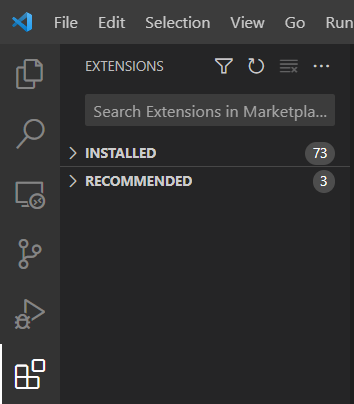
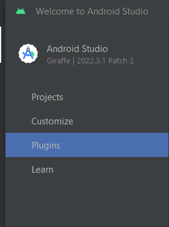

# Step by step guide to setting up development environment for Mboacare App

The following are the steps necessary to setup the development environment for Mboacare App on a Windows PC

### Table of Contents
1. Setup a GitHub Account
2. Install Git
3. Install Flutter
4. Install an IDE
5. Clone the "December 2023 to March 2024 Applicants" Repository
6. Clone and Set Up the "Mboacare" Medical App Project
7. Record Your Steps and Screenshots

## 1. Setup a GitHub Account
If you don't already have a Github account, we can create one by following the steps below.
+ Open a web browser and visit [Github](https://github.com/)
+ Click on Sign up
+ Follow the instructions to create and account it involves providing an email address, username and password

## 2. Install Git 
Our next step is to install Git. Git is version control tool that tracks changes to our code files on our computers. 
+ You download git for windows from the [Git Download page](https://git-scm.com/downloads)
+ After downloading Git the next step will be to run the downloaded stepup file. 
+ To check if Git installed successfully, Open a command prompt window and type 
``` git --version ``` press ``` Enter ``` from your keyboard
 <br>
If you see an output similar to the screenshot above then git was successfully installed.

## 3. Install Flutter SDK
Flutter is cross platform UI framework on which Mboacare is built on hence inorder to run Mboacare development environment we need to setup the flutter development environment
+ The flutter team has provided simple [guide to installing the flutter SDK](https://docs.flutter.dev/get-started/install) 
+ After installing flutter you can open a command prompt window and type ``` flutter --version ```
<br>
If you see an output similar to the screenshot above then flutter was successfully installed

## 4. Install an IDE
The next step after installing flutter will be to install an Intergrated Development Environment. The most common are Android Studion and Visual Studio Code. I usually prefer installing both.
+ You can download the [latest Visual Studio code release](https://code.visualstudio.com/)
<br>
After downloading VS Code the next step will be to install the Dart and Flutter extension. Simple visit the extension tab like on the image above search for flutter and install 
<br>
Follow same process to install Dart extension
+ You can download the [latest Android Studio release](https://www.googleadservices.com/pagead/aclk?sa=L&ai=DChcSEwie18r319iBAxXKi2gJHZHFBAMYABAAGgJ3Zg&gclid=Cj0KCQjw1OmoBhDXARIsAAAYGSG3udihx4f1BVV5XeSEabD9HN4T--qKqCQntTVRsxf6RBZEhDRESuUaAqPgEALw_wcB&ohost=www.google.com&cid=CAESVuD26-E7vK7m8Xu5bvm6zQl96aA8U9oToxoNqA8Fds5BbdD5kkEVI7NgsMobYBLxcGEknZktp9AUhaTE5sidytBHB2mYqOO-z32RNYVMqtbvRuAykFTo&sig=AOD64_1VeHsWC0upgYBovHc2v_NBTIeUdw&q&adurl&ved=2ahUKEwiYvcX319iBAxXWU6QEHcHwDC8Q0Qx6BAgGEAE)
The next step After downloading Andriod Studio will be to install the flutter and dart plugin for Android Studio

Visit the plugin Tab as on the image above

Search for flutter and install 

Lastly Search for dart and install
